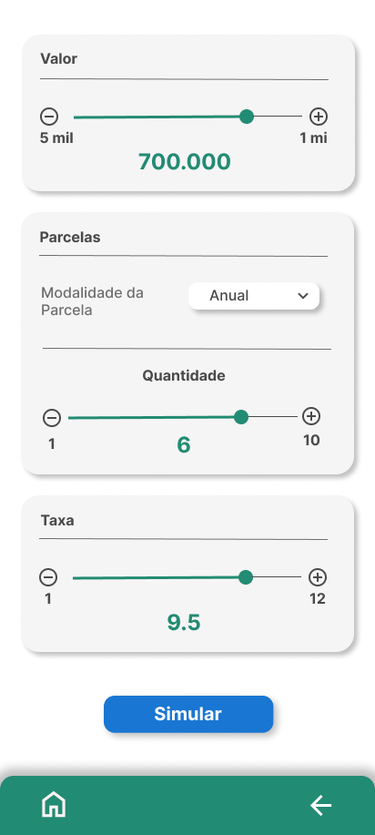
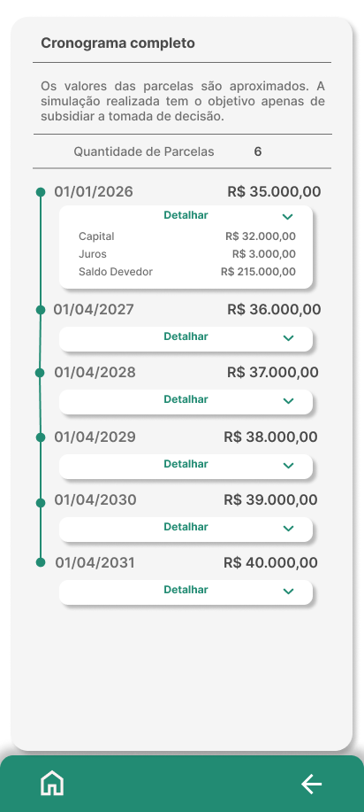

# SimulaPRONAF

**SimulaPRONAF** é um aplicativo Android desenvolvido para auxiliar agricultores familiares a simularem rapidamente condições de crédito rural com base no **PRONAF (Programa Nacional de Fortalecimento da Agricultura Familiar)**. Nesta versão MVP, o foco é oferecer uma simulação simples, intuitiva e acessível em duas telas principais.

## Objetivo

Fornecer uma ferramenta prática e confiável que permita ao agricultor visualizar o custo total e a viabilidade de um financiamento rural de forma rápida e descomplicada.

## Funcionalidades do MVP

- **Tela 1: Entrada de Dados**
    - Valor do financiamento
    - Carência
    - Taxa de juros anual
    - Quantidade de parcelas

- **Tela 2: Resultado da Simulação**
    - Valor do capital por parcela
    - Juros efetivos calculados com base em dias úteis (252)
    - Valor total por parcela 
    - Datas de vencimento das parcelas
    - Apresentação visual em cards informativos

## Tecnologias Utilizadas

- **Kotlin + Jetpack Compose** (UI moderna e declarativa)
- **Material 3** + Theming personalizado com cores verde e branco
- Arquitetura MVVM
- Organização modular por **features**
- Layout responsivo e acessível

## 🧭 Navegação do MVP

Abaixo, uma visualização da interface da funcionalidade **Simulação Rápida**, que representa o escopo inicial do projeto e constitui o **MVP (Produto Mínimo Viável)**. Essa tela permite que o usuário insira dados básicos como valor do crédito, taxa de juros anual e número de parcelas para obter uma simulação imediata e objetiva das condições de financiamento rural via PRONAF.

### 1. Tela de entrada de dados
O usuário informa o valor do crédito, a taxa anual e o número de parcelas:

### 2. Tela de resultados da simulação
Após calcular, os resultados são exibidos de forma clara e visual:

## 🛣️ Roadmap

### ✅ MVP (versão atual)
- [x] Tela de entrada de dados para simulação rápida
- [x] Layout com identidade visual (verde, branco, tipografia personalizada)
- [x] Campo de entrada de valor com **validações e placeholder** (substitui slider da v1.0 → v2.0)
- [x] Tela de exibição dos resultados em formato visual
- [x] Cálculo das parcelas, apresentando capital, juros, saldo devedor

### 🚧 Próximas etapas
- [ ] Adição de **animações suaves** ou microinterações com Compose

### 📡 Fase de expansão
- [ ] Simulação detalhada, abrangendo as diferentes **linhas do PRONAF** (como Custeio, Investimento, Mulher, Jovem, Agroecologia), com regras e condições específicas de cada modalidade.
- [ ] Integração com perfil do usuário (dados persistentes)
- [ ] Armazenamento seguro de simulações com Room (banco local)
- [ ] Exportar/Compartilhar resultado da simulação em PDF ou formato compartilhável
- [ ] Tela de ajuda/contexto com informações sobre o PRONAF

## 📦 Instalação / Build

Este repositório é **privado**.  
Para compilar o projeto, é necessário ter permissões de acesso.  

1. Abra no **Android Studio (Giraffe ou superior)**.  
2. Sincronize as dependências com o Gradle.  
3. Rode no emulador ou dispositivo físico (API 26+).  

## 📝 CHANGELOG

### [2.0.0] - 2025-09-21
#### Alterado
- Substituição do **ValorCard com Slider** (v1.0) por **ValorCardInput** com campo de texto digitável e validações.
- Novo comportamento: valor inicial vazio, `R$` fixo como prefixo e placeholder "digite o valor aqui".
- Implementação de validações:
  - Faixa de valores: **1.000 a 250.000**
  - Limite de **6 dígitos**
  - Mensagem de erro exibida caso valor esteja fora da faixa
  - Campo foca automaticamente em caso de erro
- Melhorias de usabilidade (cursor permanece no final, placeholder amigável).

#### Removido
- Slider sensível para entrada de valores, considerado de difícil uso para grandes faixas.

### [1.0.0] - 2025-07-06
#### Adicionado
- Estrutura inicial do app com duas telas (Entrada de dados + Resultados).
- ValorCard com **Slider** para entrada do valor.
- Configuração de projeto com **Kotlin**, **Jetpack Compose**, **Material 3**.

---

